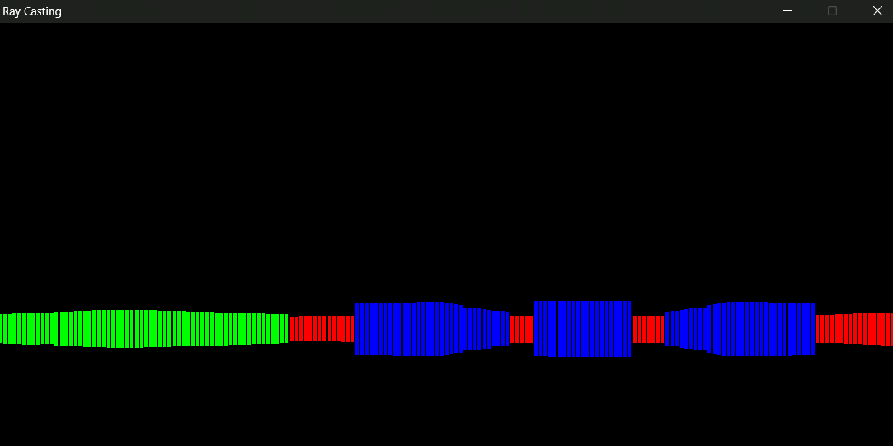
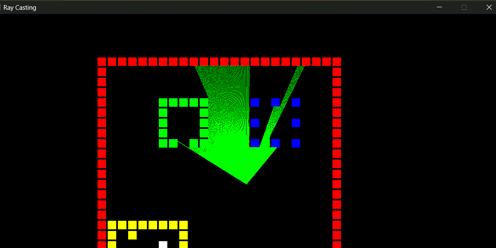
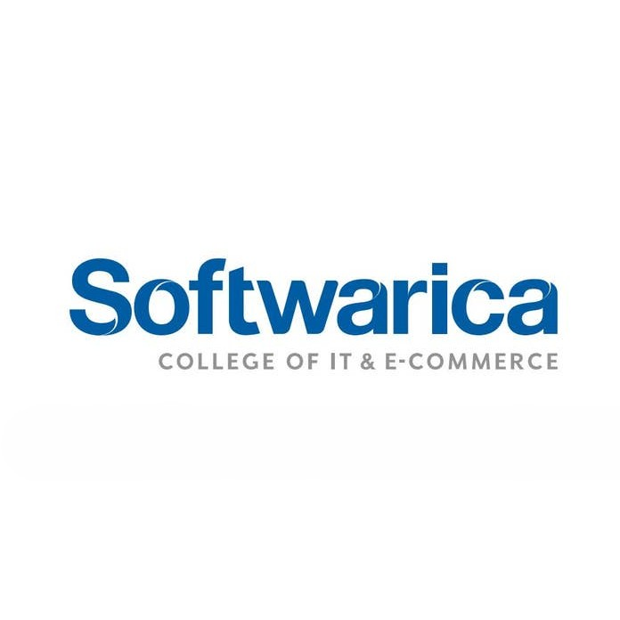

+++
date = '2026-05-01T23:06:06+05:45'
draft = false
title = 'Portfolio'
+++


This is my CV. You may want to view my [resume](./Resume.pdf) instead.



This portofolio is unfinished.


## Projects

<h3>
Malloc From Scratch
<a class="permalink" href="#project-malloc-from-scratch"
aria-label="Permalink to Malloc From Scratch"></a>

</h3>
April 2026
    

        <a href="https://www.github.com/xyzeep/malloc_from_scratch" target = "_blank" class="link-with-icon">
        GitHub</a>
    

Implementations of C standard library memory-related functions, like malloc(), calloc(), realloc(), and free(), from scratch.

<h3>
RayCasting in C with SDL3
<a class="permalink" href="#project-raycasting" aria-label="Permalink to Ray Casting in C"></a>

</h3>
March 2026
    

        <a href="https://www.github.com/xyzeep/Ray-Casting" target = "_blank" class="link-with-icon">
        GitHub</a>
    

a simple implementation of 2D and 3D ray casting engine written in C using SDL3. It simulates a basic first-person view similar to games like Wolfenstein 3D by casting rays from the player’s position to detect walls and render a pseudo-3D scene. You can move around the map with WSAD keys and look around using the mouse to interact with the scene in real time.

<h3>
WurdUp
<a class="permalink" href="#project-wurdup"
aria-label="Permalink to Wurdup"></a>

</h3>
March 2026
    

        <a href="https://www.github.com/xyzeep/wurdup" target = "_blank" class="link-with-icon">
        GitHub</a>
                <a href="https://wurdup.netlify.app" target = "_blank" class="link-with-icon">
        Website</a>
    

WurdUp, a word guessing game. Can you figure out what the wurd is?

## Education

<h3>
B.S. (Hons) Computer Science with AI
<a class="permalink" href="#education-bachelors"
aria-label="Permalink to Bachelors Education"></a>

</h3>
April 2024 - Present
    

        <a href="https://softwarica.edu.np/" target = "_blank">Softwarica College</a>
    

I am currently pursuing a Bachelor's degree in Computer Science and am in my 5th semester.

Notable modules I took...

<ul>
    <li>
        Object Oriented Programming with JAVA
    </li>
    <li>
        Computer Architecture and Networks
    </li>
    <li>
        Database System
    </li>
    <li>
        Mathematics for Computer Science
    </li>
    <li>
        Software Design
    </li>
    <li>
        Advanced Algorithms
    </li>
    <li>
        Operating Systems and Security
    </li>
    <li>
        Theory of Computation
    </li>
    <li>
        Data Science
    </li>
    <li>
        Machine Learning and Related Applications
    </li>
<ul>

<!-- 
 -->
<!--################################-->
<!-- 

+1 More

 -->
<!---->
<!---->
<!---->
<!-- 
 -->
<!---->
<!-- 
 -->
<!-- 
 -->
<!--  -->
<!-- 
 -->
<!-- <h3> -->
<!-- B.S. (Hons) Computer Science with AI -->
<!-- <a class="permalink" href="#education-bachelors" -->
<!-- aria-label="Permalink to Bachelors Education"></a> -->
<!---->
<!-- </h3> -->
<!-- April 2024 - Present -->
<!--     
 -->
<!--         <a href="https://softwarica.edu.np/" target = "_blank">Softwarica College</a> -->
<!--     
 -->
<!-- 
 -->
<!-- 
 -->
<!-- 
 -->
<!---->
<!-- 
 -->
<!-- 
 -->
<!-- 
 -->
<!-- 
 -->
<!--################################-->

## Experience



<h3>
Language Instructor
<a class="permalink" href="#experience-language-instructor"
aria-label="Permalink to Language Instructor"></a>
</h3>
April 2025 - May 2025

<a href="#experience-language-instructor">Student Folio</a>

Though not my primary field of choice, I have worked as a language instructor for about a year, during which I taught and guided students preparing for exams such as IELTS, PTE, CAS interviews, and the Duolingo English Test.

<!-- 
 -->
<!-- 
Notable initiatives and projects include...
 -->
<!-- <ul> -->
<!--     <li> -->
<!--         something -->
<!--     </li> -->
<!--     <li> -->
<!--         something 2 -->
<!--     </li> -->
<!--     <li> -->
<!--         something else -->
<!--     </li> -->
<!-- <ul> -->

