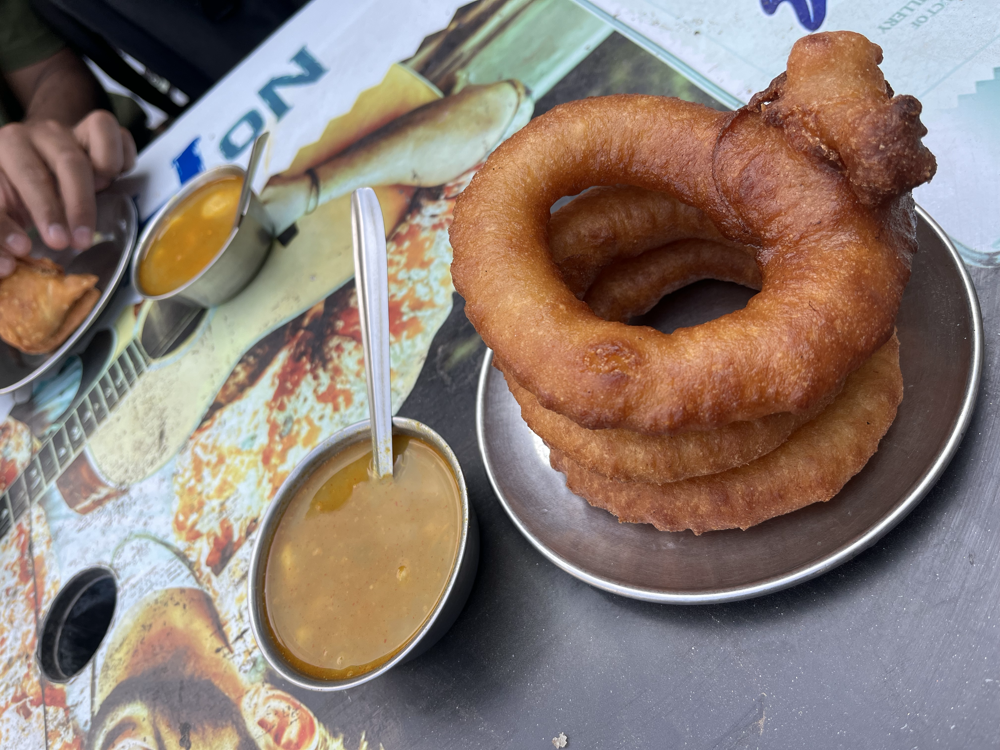

_"You're holding it too tight; let it loose the steering wheel of life, swerve it a little, and change the lanes every once in while."_ I said this to my friend on an evening walk and turns out he's started day drinking nowadays. To exercise my own wisdom, I went a hike (my first hike) to Dhap Dam with my friends yesterday. It was great and I wanted to write about the whole expereince and share some pictures. This post is not only going to serve as a "blog", but it can also be used a guide to anyone who wants to do this hike; I am not an expert but I will tell you what I now know.

We were a group of seven friends. The plan was to meet at the bus stop near Kathmandu Mall before 6:30 in the morning; but because I was excited and my phone shows the time correctly, I arrived there at 6:20 and waited for my friends to come. After like 30 minutes, all 6 of us were there. Our 7th friend was waiting for us in Gokarneshwor. Everyone had their very believable reasons to be late (hahaha). We took a bus from there to Sundarijal Buspark. An army marches on its stomach: we had breakfast there and bought snacks to make sure we don't give up on the way. Finally, we started the hike at 9:00. My advice? Please be on time and start the hike as early as you can.

