_"You're holding it too tight. Let loose the steering wheel of life, swerve a little, and change lanes every once in a while."_

I said this to my friend during an evening walk, and turns out he has started day drinking these days. To exercise my own wisdom, I went on a hike (my first hike) to Dhap Dam with my friends yesterday. It was great and I wanted to write about the whole expereince and share some pictures. This is a poorly written post, and I am not an expert, so you might not want to read this as a guide if you are planning to do this hike.

<!--more-->

 

## Getting there
We were a group of seven friends. The plan was to meet at the bus stop near Kathmandu Mall before 6:30 in the morning, but because I was excited and my phone shows the time correctly, I arrived there at 6:20 and waited for my friends to come. After about 30 minutes, all six of us were there. Our seventh friend was waiting for us in Gokarneshwor. Everyone had their very believable reasons for being late (hahaha). We took a bus from there to Sundarijal Buspark. We had breakfast first because, you know, an army marches on its stomach. Finally, we started the hike at 9:00. My advice? Please be on time and start the hike as early as you can.

The start was the most difficult part of the hike. For more than an hour, it was a very steep uphill climb. That alone had us panting. On the bright side, it wasn't boring; we hiked through Mulkharka Village. The smell of food, greenery, and cow dung was really something else. The fact that people there walk that trail everyday gave me a sense of shame that pushed me to keep going.

About 3 km before reaching Dhap Dam, there’s a spot called Dham Dam Junction, where a 65-year-old man named Sher Bahadur runs a small shop. We stopped there for tea and borrowed a sickle to cut veggies for chatpate. After spending a good 15–20 minutes there, we continued walking. It took us a little more than five hours in total to reach the destination, which is funny because people online say it took them only about three. It’s probably because either they were lying, or we were very slow and stopped a lot to take pictures. We were using the app _maps.me_, which came in really handy when the trail was confusing at times.

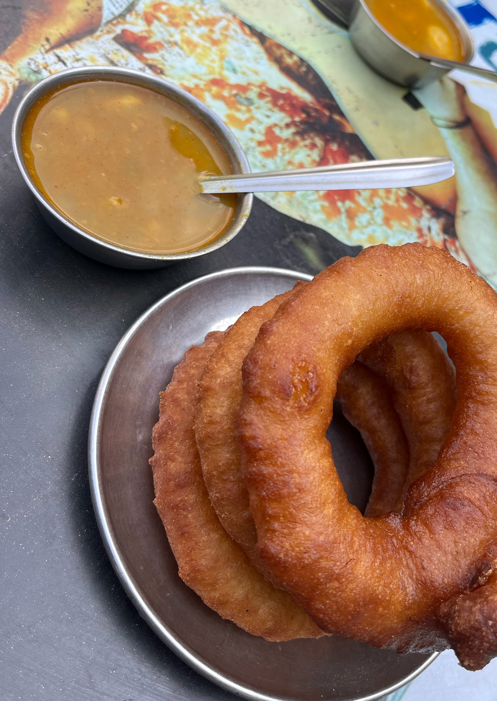

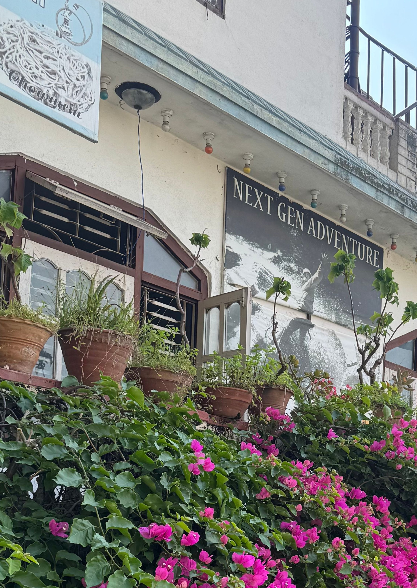

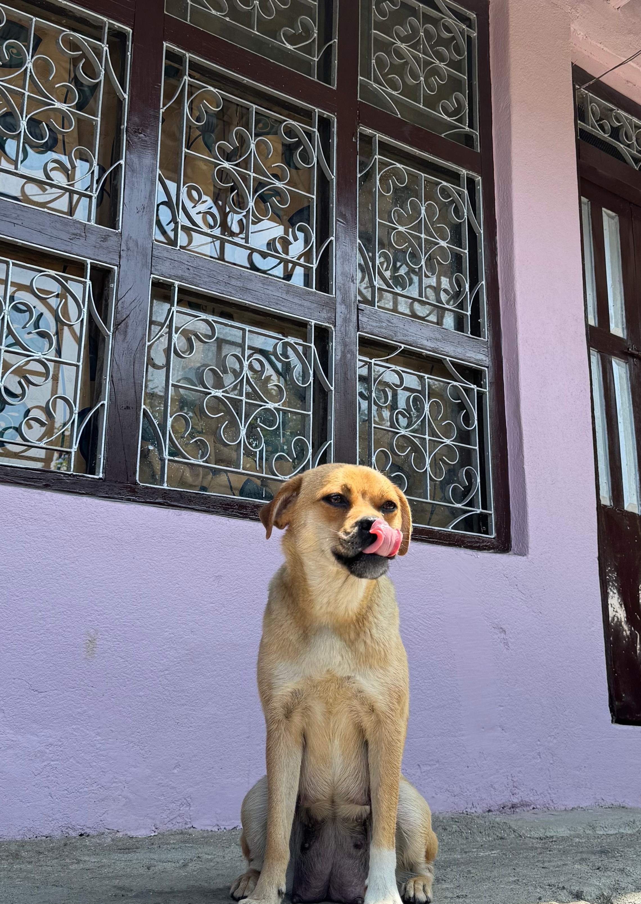

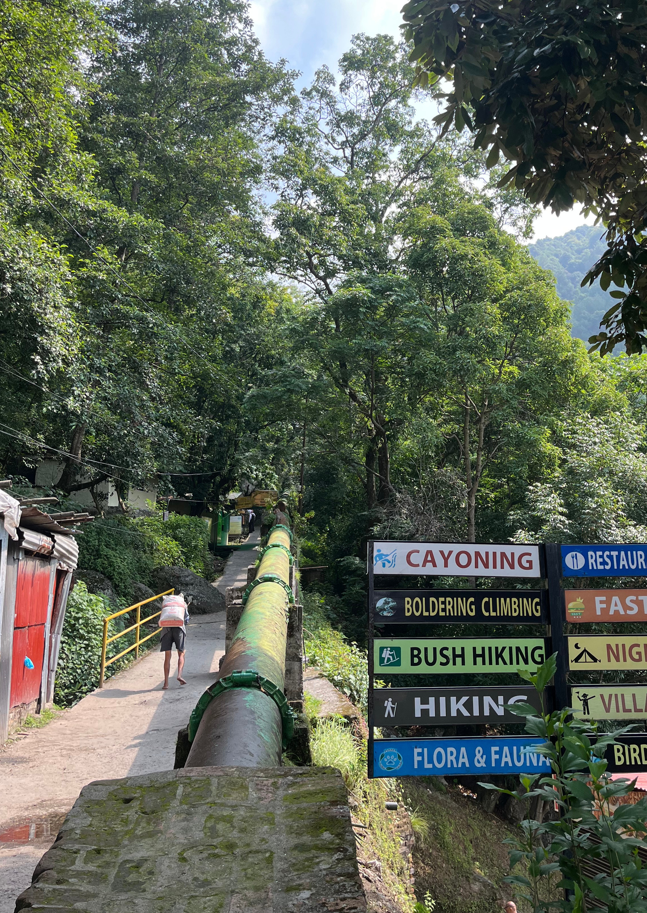

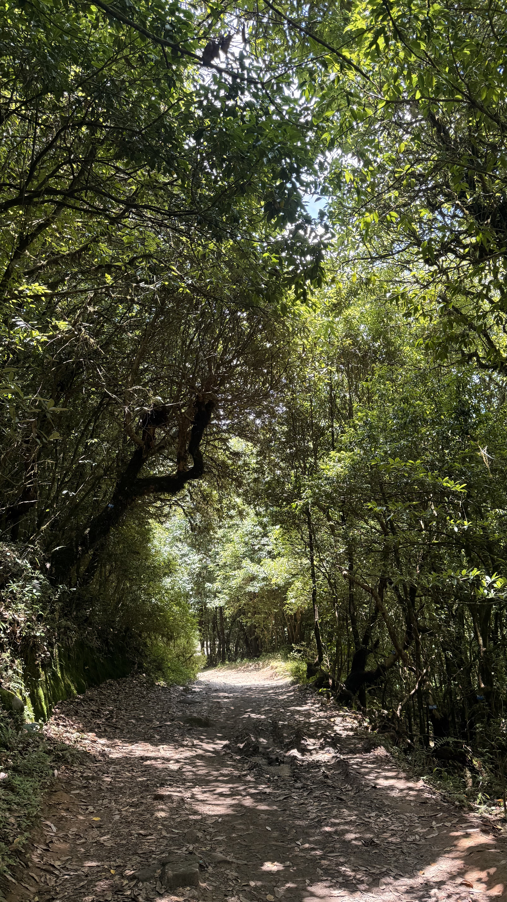

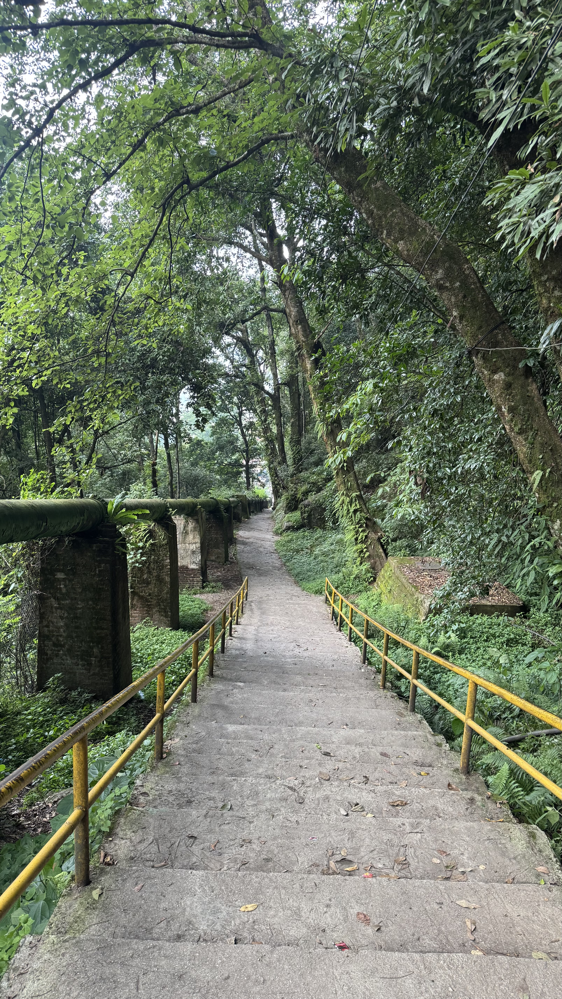

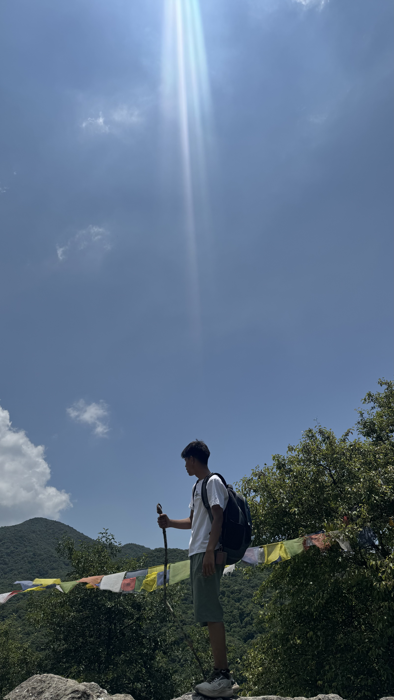

 

## At the destination

Upon reaching the destination, it was already 2 PM. We sat on the stones and relaxed for a bit. Since the weather was nice and sunny, the view was stunning. We didn’t have much time to spend there, but boy, we were hungry. We found a spot where we made and ate chatpate. If you’re worried that we made a mess, don’t worry, we don't litter. With our tummies full, we clicked a lot of pictures. The lake, the cool breeze, the feeling of being unbothered by the sun, the smell, everything was pleasant and refreshing. For a moment, that completely made me forget that we had to walk back for another 3 to 4 hours.

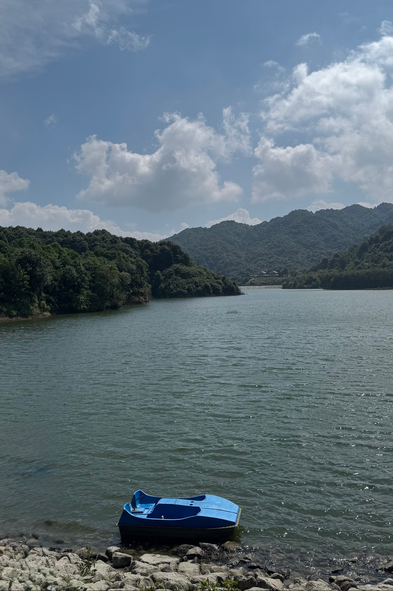

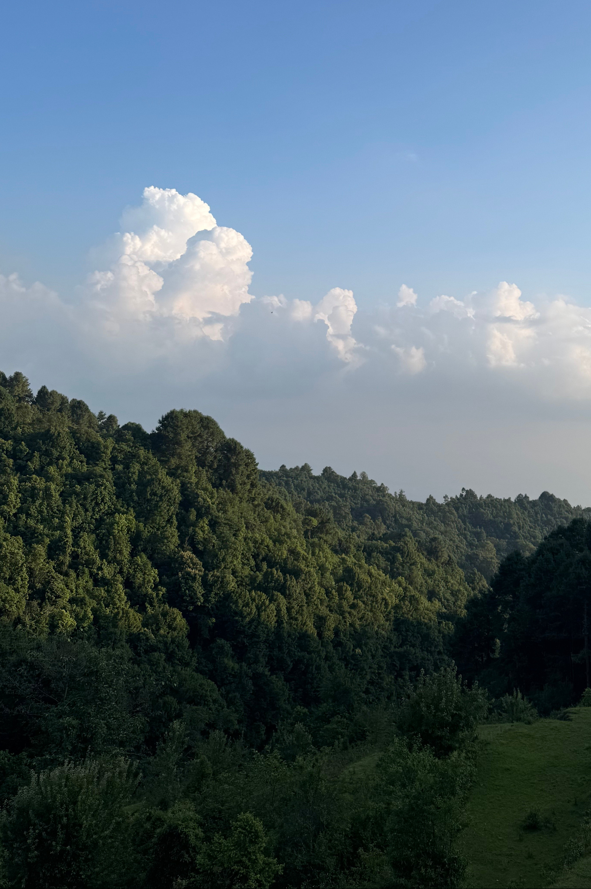

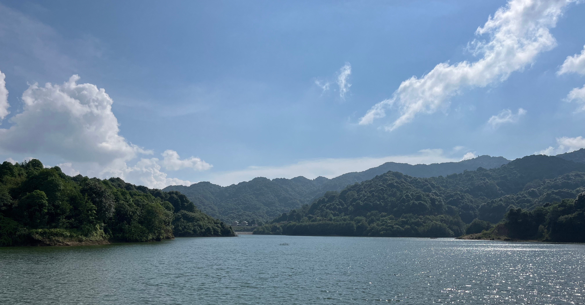

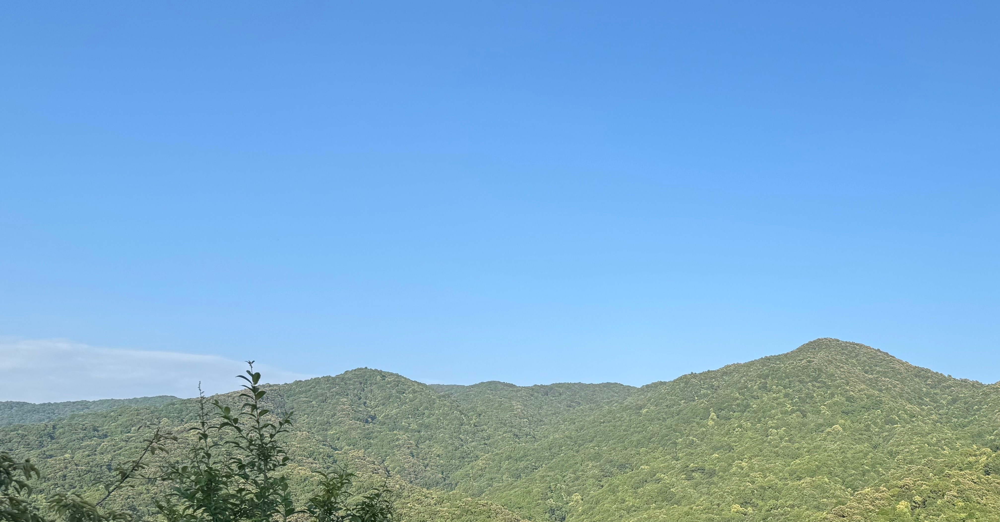

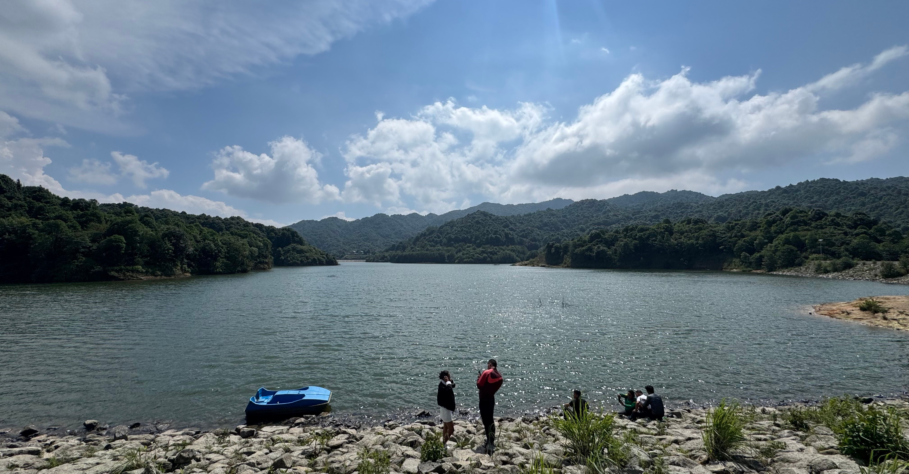

 

## Accidental detour

I’m guessing it was almost 4:00 when we started to descend. Of course, the way back is always easier than walking uphill. It’s the boring part; I even thought about not writing this section. However, something weird happened on the way back. Remember how we went through Mulkharka Village while hiking up? Well, it turns out we unknowingly took a different route somewhere along the way. We came back by the road (used by bikes and buses to reach the destination), not the trail. What’s even crazier is that we were walking in two separate groups while returning, but we all ended up taking the same route. There’s that. It was already around 7:30 PM and dark when we got back to where we had started. There were no buses left. We were lucky that one (and only one) bus was at least going to the Bouddha area, because that’s where its garage is, apparently. From there, we all went back to our places.

---

If you read the whole thing, thank you. If you didn't, thank you for visiting at least. If you had a good time reading this, you can also buy me momo (see below). Honestly, I’d rather have you read the whole thing than buy me momo, but who says you can’t do both?

