## Day 1: The boring first part.
27th May, Wednesday.  
Goal: Be in Sauraha before midnight.

We arrived at the buspark at around 4 in the evening. We were so certain that we were going to find a bus or HiAce to Sauraha. I mean there are always so many of those going to places evey hour of the day, right? Wrong. All the vehicles for Sauraha had left already. We could only find a few left that were going to Narayanghat (~20 km away from Sauraha). We had no other choice; we got a ticket for 3 @Rs.1800. We left Kathmandu at around 5. The driver's playlist full of songs with AI vocals made my head hurt for the first half of the journey. After eating in Malekhu, I was DJ-ing the other half of the journey, and boy, the other passengers started to sing along and whatnot. Immaculate taste, Pawan (*patting myself on the back*).

<!--more-->

Hours later: we arrived at the Pulchwok Buspark at around 11 PM. Despite it being that late, there were a lot of people like us, travelling to places. From there, we took a tuk-tuk to Sauraha chowk (aka Gaida Chowk) for Rs. 500. A staff of the hotel we had booked for that night said he is going to send "their tuk-tuk guy" to Sauraha Chowk to pick us up and drop right in front of our hotel room. The way he phrased it sounded like the "tuk-tuk guy" worked for the hotel and we thought it was a part of the hotel's service. Long story short, we ended up paying him Rs. 600 (i.e., circa 20% more compared to the last tuk-tuk).

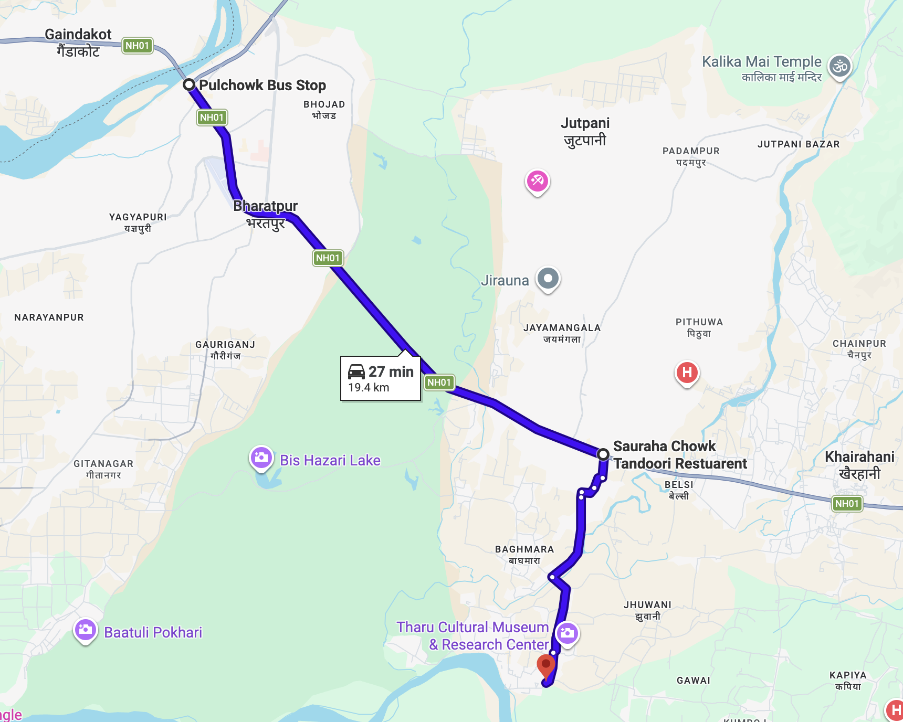

tuk-tuk that we took (glad it rhymes) from Narayanghat to Sauraha Chowk.

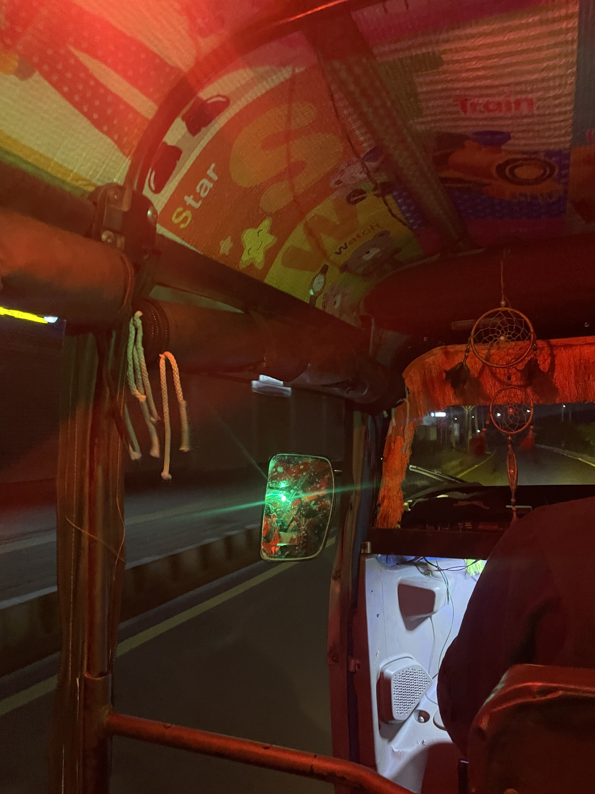

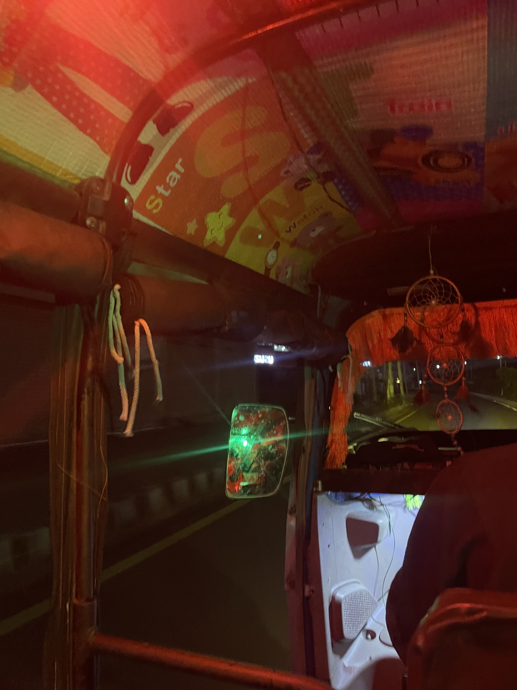

We arrived at the hotel room at midnight and got a good night's sleep. We didn't eat anything, as we were not that hungry after eating in Malekhu.

---

# Day 2: Mr. Spontaneous
Goal: Arrive at the hackathon venue and have fun.

We woke up early in the morning and got freshened up. We had to stay at this hotel because the venue was booked for the participants only from Thursday to Monday morning. We put on some nice clothes as it was our roam-outside day. We made some tiktoks and clicked some pictures at that hotel. We, again, took a tuk-tuk to our venue, which was not very far. It was really hot that day; I could feel the heat under my skin. It was a rest day; the hackathon would only start from Friday. We were really hungry; we left our bags and went outside to eat something. I spotted a vegetarian restaurant and convinced my friends to give it a try. The food was great there: _puri tarkari, samosa, jerri, roti_; everything was fresh and yummy.

After spending almost an hour at that restaurant, we went back to the hotel for swimming, and the good part? None of us knew how to swim. After being in the water for hours, I started to have a very strong desire to have a hot cup of tea. A cup of tea on a hot summer day in Chitwan? Yes. I mean, why not? Just as we were passing through the gate, we saw a green Jeep in front of us. Wanting to have a conversation, I aksed the guy where they were going. They were taking tourists on a Jeep Safari and asked if we wanted to come along. I insisted that we should go. And just like that, we went to have a cup of tea, but instead ended up on a jeep safari. The guide was a really chill guy.

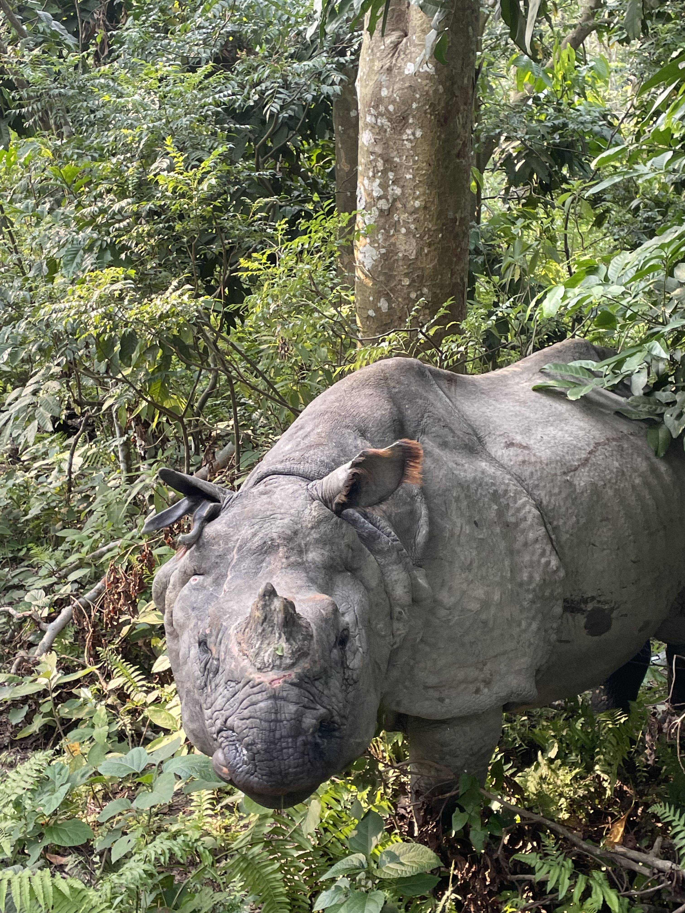

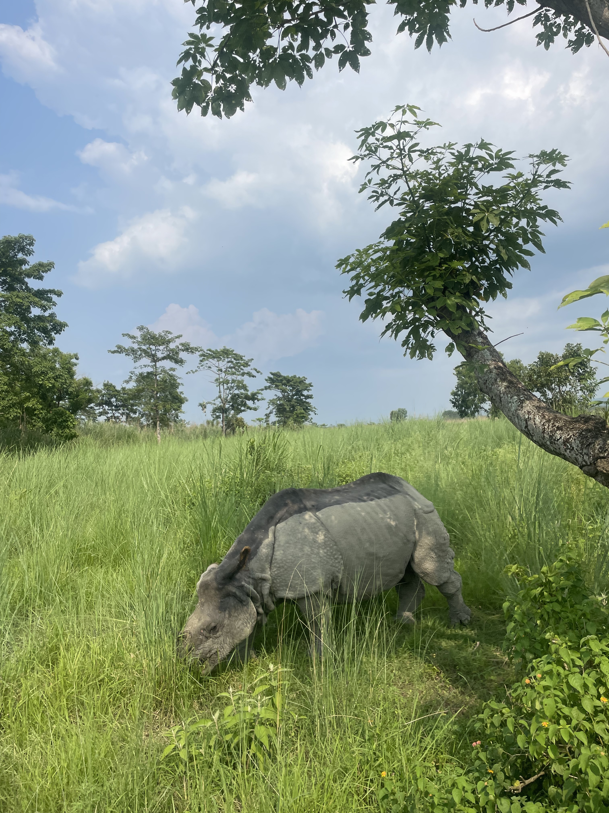

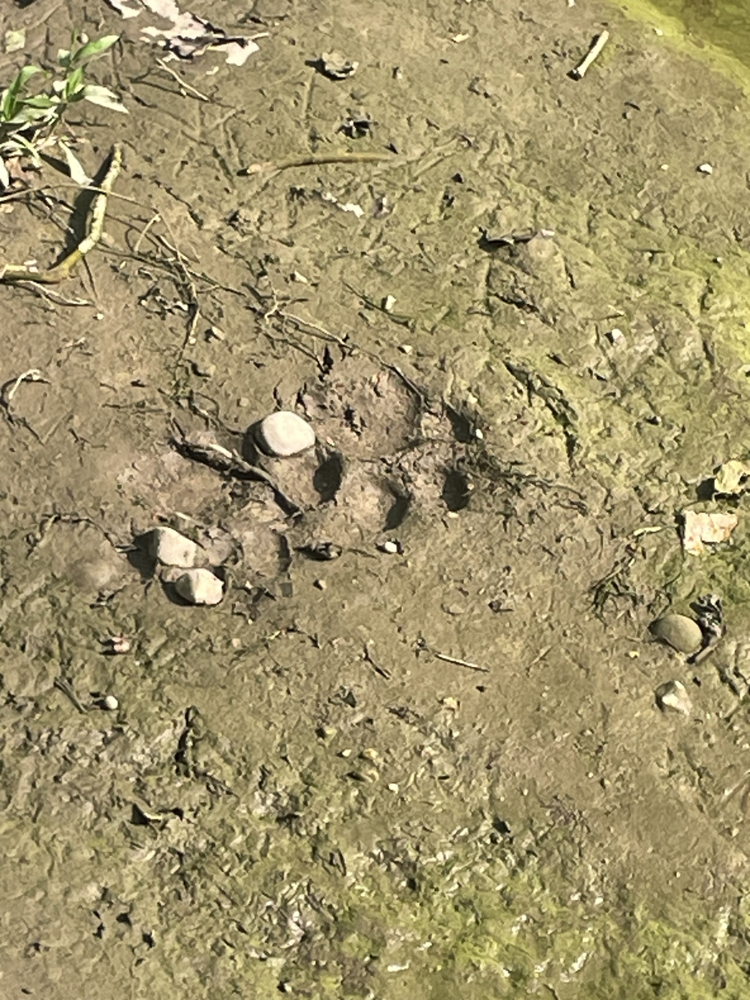

We saw different kinds of animals and birds there, many of which I don't know the names or have pictures of. Unfortunately, we didn't see any tiger, but we did see paw prints of one.

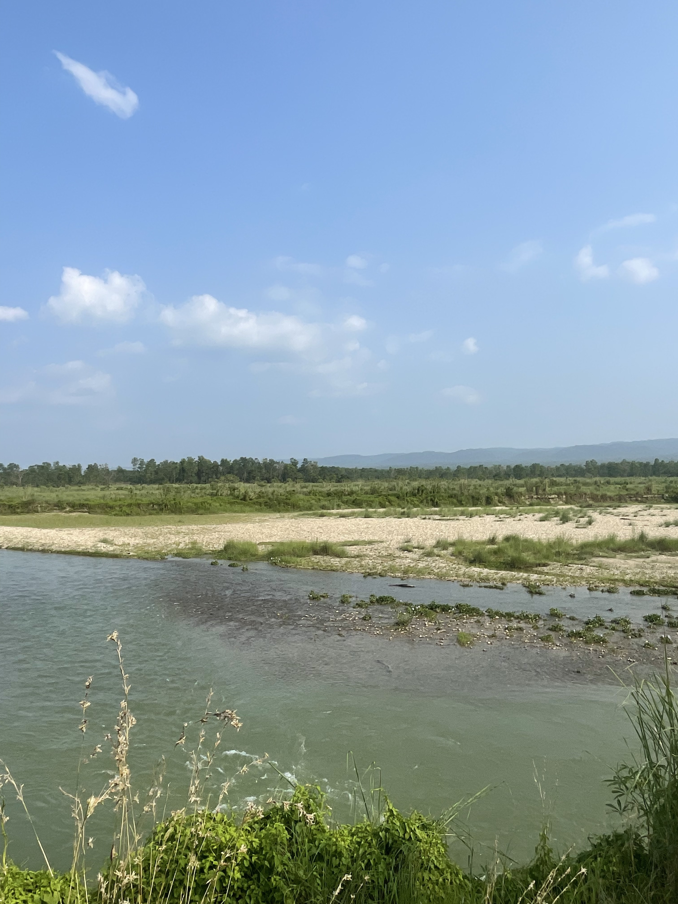
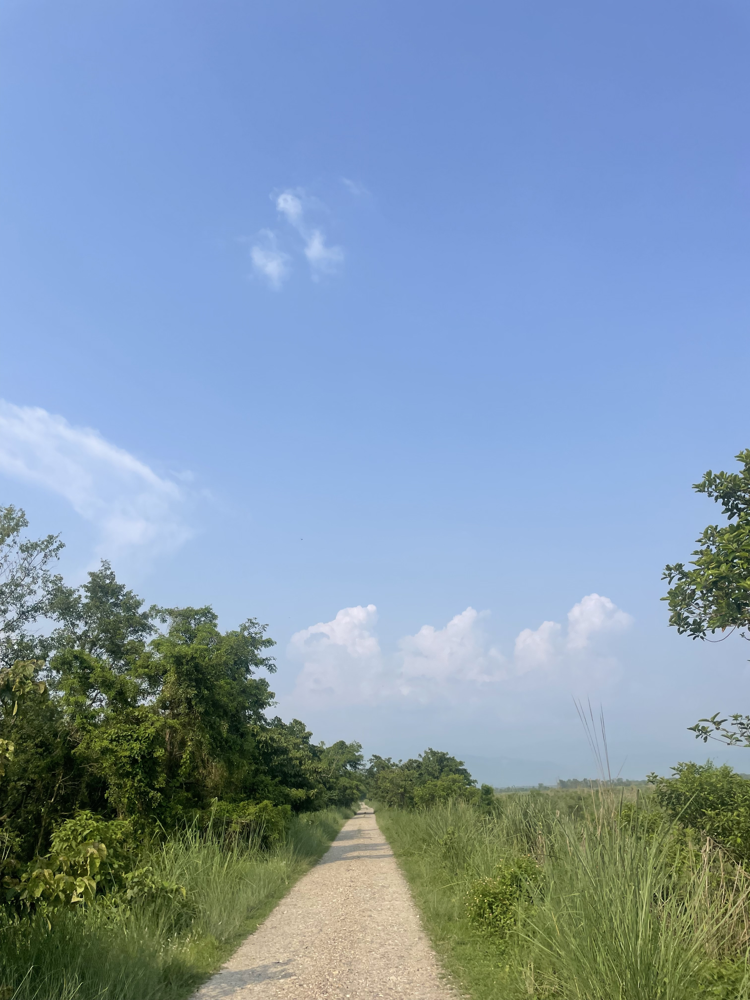
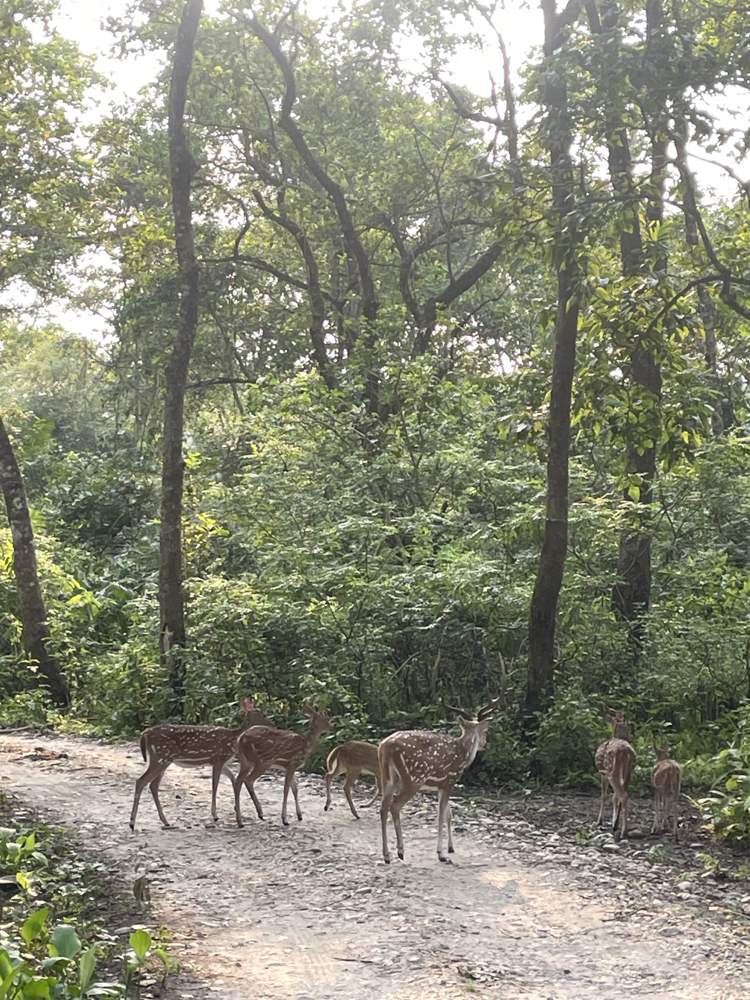

---

## Day 3 - Day 5: Hackathon

I don't have much to say about the hackathon itself. You all know how it goes. The event management was top-notch; this was by far the best hackathon I have participated in. There were so many mango and lychee trees in the hotel area. We were allowed to eat as many as we could. The people from eSewa and WWF, the participants, hotel staff, and everyone were very friendly and helpful. It felt more like a vacation than a hackathon. We were not one of the winnig teams, but we learned a lot about about our weaknesses and strengths. We got to meet people from different parts of the country. Overall, it was a blast.

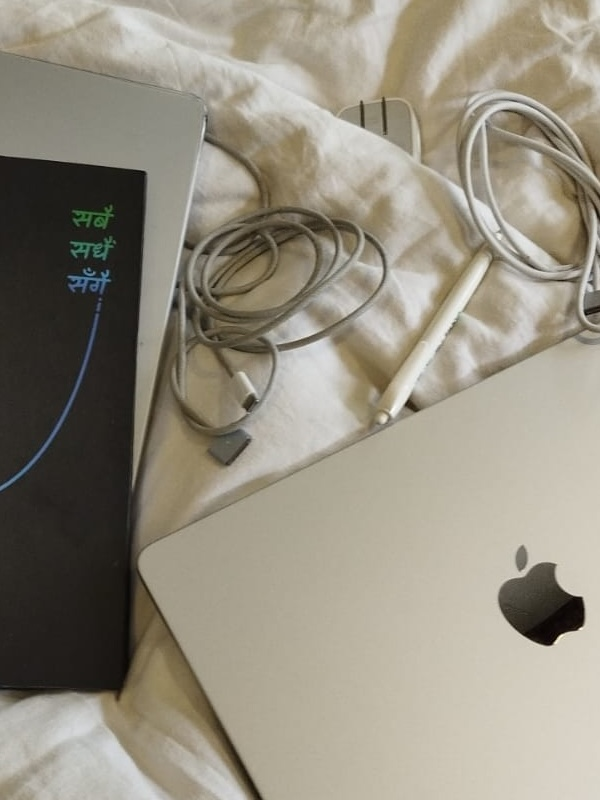
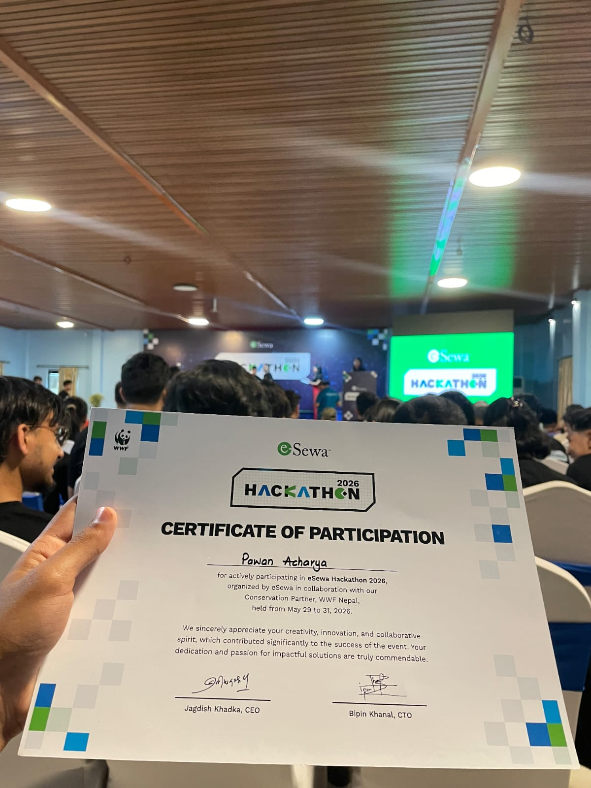
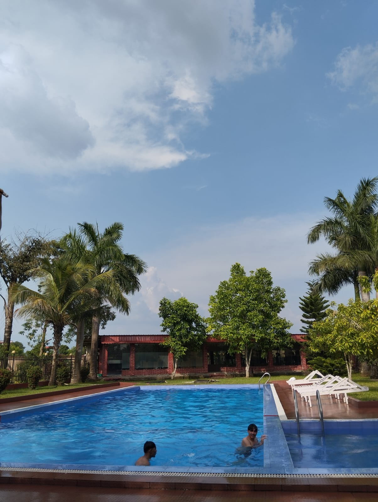
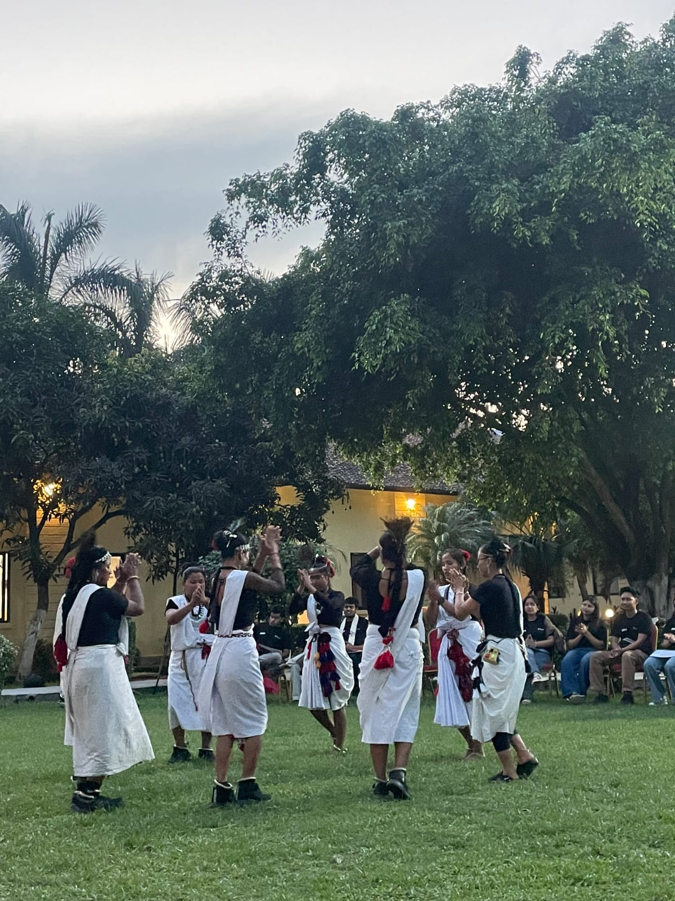

 

---
 

If you read the whole thing, you're amazing and I love you. If you scrolled to skip to the bottom, that's okay. If you loved reading this so so much, you can also [buy me momo](https://buymemomo.com/pawan) (see below).

