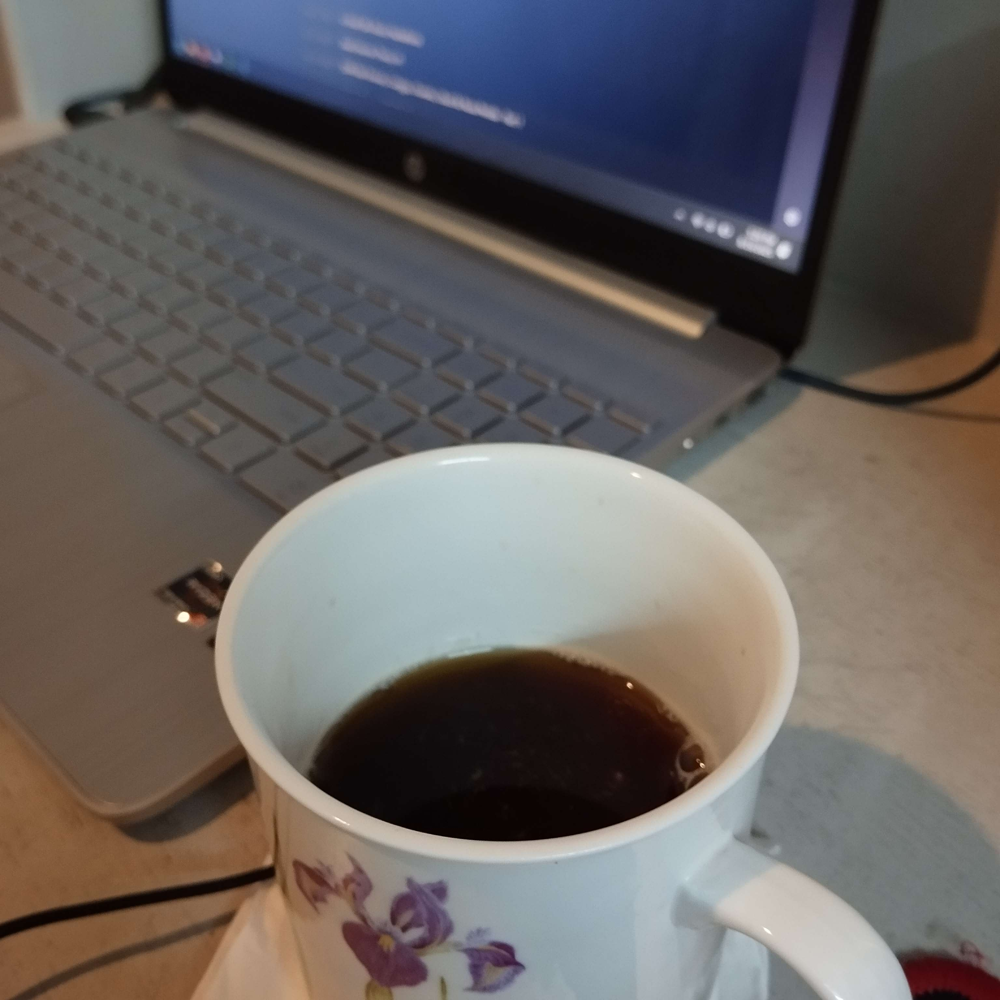

# How I Make My Coffee

Everyone has their own way of making coffee, and for me it's like a small everyday ritual that I really enjoy. I don't use any fancy machines or special tools because I don't own any. I like to keep it simple because I am forced to, but it still tastes great every single time.

The first thing I do is boil some water using my electric water kettle. While I wait for it to heat up, I take out my favorite cup (the only cup I have) and pour in some coffee in it directly from the coffee box. I feel like a chemist who is carefully mixing chemicals. Remember [that one Breaking Bad meme](https://knowyourmeme.com/memes/walter-white-cooking)?

Once the water is ready, I add just a little bit of hot water to the coffee. Then I gently move the cup in a circular motion. This helps the coffee mix well and makes the flavor stronger. After that, I pour more hot water to fill up the cup. The smell of fresh coffee always makes me feel awake and triggers my bowel movement, of course. Finally, I take a sip and enjoy it slowly. It's a very simple process, but it's special: just like you, you beautiful human reading this fuckass blog.

Well, that's how I make my coffee every day. No sugar, no milk, because I can't afford any of that, just plain coffee. It's not perfect, but it gets the job done, so it's perfect for me.
