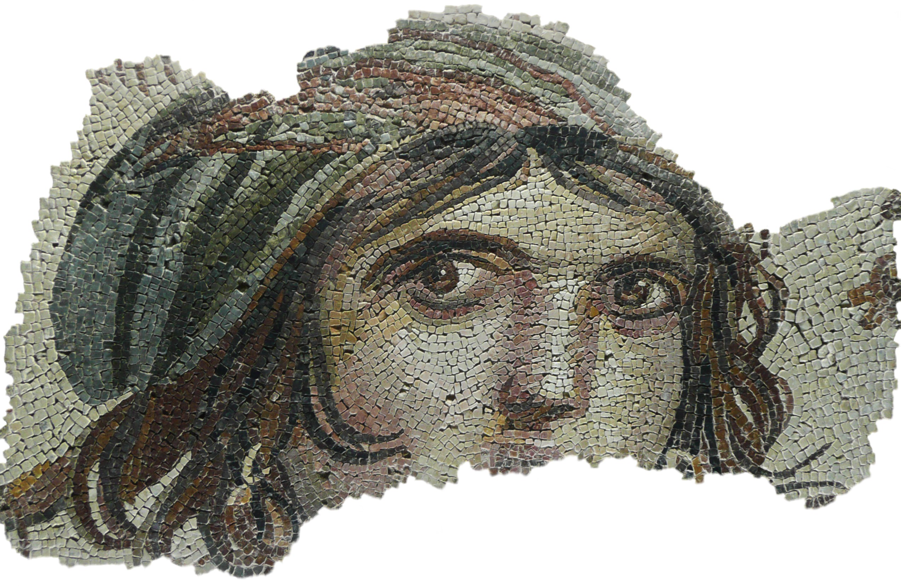
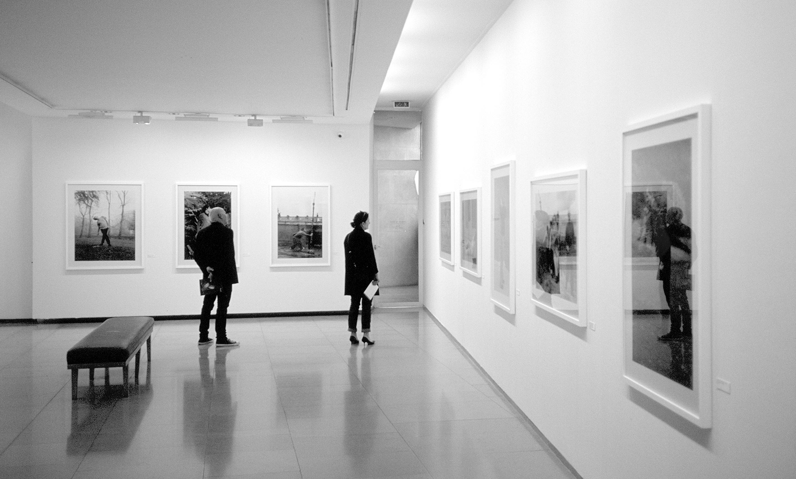

Nothing you do in life is original. The way you walk, talk, and eat. The way you brush your teeth or hold your coffee mug. Your choice of words, your dance steps, and your taste in music, fashion, or lifestyle. The way you do your makeup or trim your beard. The music you create, the songs you write, and the essays you craft. Your worldview, political beliefs, conscience, and most importantly your thoughts.

What does it even mean to be original? Originality is defined as the quality of being new and interesting in a way that is different from anything that has existed before. Is anything you do or think truly different from what has come before? I want you to really think about this. What do you think is the most original thing you’ve done in your life?

Everything you do or think is always, in some way, influenced by something. You cook your meals a certain way because that’s how your mom taught you to cook. You think your handwriting is original, but it resembles twelve different handwritings you tried to copy from your friends in school. You tie your shoelaces the same way billions of other people do. You started drinking coffee without sugar not because you randomly decided to, but because you were convinced by the internet. Even your name isn’t original. You share it with thousands.

Your thought process isn’t original. You were shaped to think this way. Our thoughts are largely influenced by our circle, religion, culture, upbringing, and the internet. Every opinion you hold, every decision you make, every belief you have is, directly or indirectly, a result of what you’ve seen, read, or heard. It’s not very obvious because the influence is almost always on a subconscious level. Even this essay I am writing right now is not original by definition. I can guarantee you something similar is already out there, and I am not the first person to think about this. I’d be shocked (and honored) if that weren’t the case.

What’s original, then? Is nothing in life original? My dear reader, I don’t know, and it made me feel very upset when I first thought about this. However, the more I thought about the originality of things, the more my mind kept returning to nature. Things that were here before anything else. Things we don’t know the why or how of. The universe. The atoms in our bodies and the neurons that fire in our brains. The wind that moves without form, the cycle of life and death, and the fabric of space and time. That’s original. Only the universe, in its purest form, is original.

Don’t get me wrong, I am not complaining. In fact, I think this is beautiful. Being unoriginal is how you learn and do anything in life. You wouldn’t be here if it wasn’t for unoriginality. Your existence depends on it. You are layers of what came before you, a collection of everything you’ve learned from the people you’ve met. You’re a museum of all the ideas, beliefs, and humor that have stayed with you. You’re a canvas, and your personality is a painting made of a gazillion brushstrokes. You are a collage, and your thoughts are a photo album. You’re a piece of choreography, a film directed by a thousand different minds. And we’re all, in some way, painters and directors of someone else’s life.

And hey, maybe you are original. Maybe the very museum you carry within you is original. You’re the only human in this giant cosmic mess with this exact combination of unoriginal pieces. That is what makes you original. If the stars, the wind, and this giant rock we live on are original, so are you. Because what are you if not the same particles of stardust arranged in a way that has never existed before? You are the universe.

---

Thank you for reading my unoriginal essay. If you read the whole thing, I love you. If you didn’t, that’s okay; at least you came for a visit. Thank you for stopping by.
